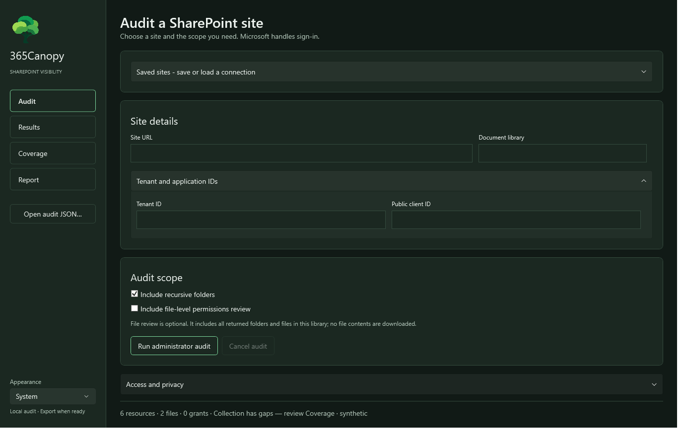
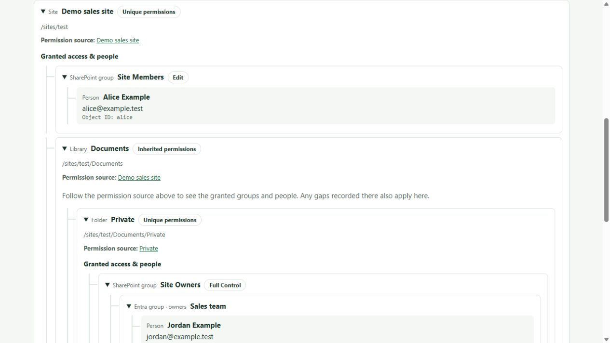

# 365Canopy

**See who has access to a SharePoint document library.**

365Canopy is a Windows desktop permissions audit tool from NVZLAB. Explore a site,
its library, folders and optionally files, then follow permission grants through
classic SharePoint groups and Microsoft Entra groups to the observed people.

**Status: 0.1.0-alpha.7 - development preview.** This is observed permission evidence,
with explicit coverage gaps, rather than a complete effective-access evaluator.



## What it does

- Administrator sign-in through Microsoft's interactive authentication; no client secret or certificate.
- Recursive folder inventory and optional file-level permission review, off by default.
- Unique/inherited permission sources, classic SharePoint groups, Entra members/owners and available usernames.
- Separate Audit, Results, Coverage and Report pages; automatic Results navigation on completion.
- Offline HTML permissions tree with expandable groups and people, plus CSV and JSON exports.
- Explicitly saved, named connections encrypted for the current Windows account.
- System, Light and Dark appearance, with Windows high-contrast and animation preferences respected.



## Run a preview

Requires Windows x64, an HTTPS commercial SharePoint site collection, and an administrator
account with sufficient access to the target content. Admin directory roles alone do not
ensure that all target content can be read.

When a GitHub prerelease is available, download its setup executable and matching SHA-256
file. The installer includes .NET, PowerShell and PnP; separate runtime installation is
unnecessary. Preview executables are unsigned. See [desktop instructions](docs/desktop-preview.md).

1. Configure your own single-tenant native public-client registration with localhost redirect.
2. Review and grant the delegated permissions described in [tenant setup](docs/delegated-checkpoint.md).
3. Enter your site URL, tenant GUID, public client GUID and library name in Audit.
4. Select the scope and run the administrator audit. Microsoft handles sign-in and MFA.
5. Review Results and Coverage before exporting or sharing the report.

Tested consent includes SharePoint **AllSites.FullControl**, and Graph **GroupMember.Read.All**,
**User.Read** and **User.ReadBasic.All**. Full Control is write-capable even though the collector
uses read operations. Canopy does not create app registrations or grant consent during audits.
The separate development registration helper starts with read scopes and is not a complete
production onboarding wizard. Never paste passwords, MFA codes or tokens into this project.

## Privacy and evidence boundaries

Fields start blank. Named site profiles are stored at `%LOCALAPPDATA%/365Canopy/sites.protected`,
protected by Windows DPAPI for the current user. They contain connection metadata and options,
not credentials, tokens or audit results. Profiles are loaded explicitly and do not start an audit.
Other processes running as the same Windows account are outside that protection boundary.

Audit evidence remains in application memory until explicit export. Microsoft/browser sign-in
state can persist separately. Exports contain tenant identities and permissions: keep them private.

File contents, versions, sharing-link details and policy-aware effective access are outside this
preview. Hidden membership, inaccessible resources and service/API omissions can leave gaps.
File discovery stops at 40,000 returned items; incomplete collection remains partial or unknown.
A missing grant or person does not establish absence of access. See [coverage details](docs/desktop-preview.md).

## Build and check

Use Windows, PowerShell 7, the .NET 10 SDK specified by `global.json`, and Inno Setup 6.
Use an extracted official Windows x64 PowerShell 7.6.6 distribution as the bundled runtime.

```powershell
# Downloads pinned modules into ignored work/modules; no global installation.
./Setup-Checkpoint.ps1 -DesktopOnly
./Start-365Canopy.ps1 -Check
dotnet run --project tests/Canopy.ReportChecks
./scripts/Build-Desktop.ps1 -PowerShellRuntime 'C:/Tools/PowerShell-7.6.6'
```

Override `-Dotnet`, `-InnoCompiler` or `-PnPModulePath` when necessary. The build has no dependency
on a sibling Lantern checkout. Outputs stay under ignored `artifacts/`; source publication uses
an explicit allowlist through `scripts/Prepare-Publication.ps1`.

## Project and release information

[Security and privacy reporting](SECURITY.txt) · [Alpha.7 release notes](RELEASE_NOTES.txt) · [Third-party notices](THIRD_PARTY_NOTICES.txt) · [MIT license](LICENSE)

Development checks include synthetic traversal, token/account binding, membership cycles,
unknown inheritance, export escaping and read-operation regression guards. The app has passed
live development audits and user testing; clean-machine installation, publisher signing,
complete transitive dependency notices and bundled-module vulnerability verification remain release gates. The desktop project restore audit completed without warnings after a network-enabled retry; it does not cover the separately bundled PnP assemblies.
Historical [checkpoint notes](docs/checkpoint-1.md) describe an earlier, incomplete authentication spike.
The current desktop uses the [delegated collector](docs/delegated-checkpoint.md).

Inspired by 365Lantern. Broader Microsoft 365 visibility and future integration remain design directions.
